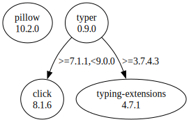

# Third Party Dependencies

<!--[[[fill sbom_sha256()]]]-->
The [SBOM in CycloneDX v1.4 JSON format](https://git.sr.ht/~sthagen/piemap/blob/default/etc/sbom/cdx.json) with SHA256 checksum ([60c8d50f ...](https://git.sr.ht/~sthagen/piemap/blob/default/etc/sbom/cdx.json.sha256 "sha256:60c8d50f00426501207fb0fd9199f9b556778a7ae387d370dd49a1bfe11163b1")).
<!--[[[end]]] (checksum: 90a4e6b0efe3ddc7b5d5b93bc742f3eb)-->
## Licenses 

JSON files with complete license info of: [direct dependencies](direct-dependency-licenses.json) | [all dependencies](all-dependency-licenses.json)

### Direct Dependencies

<!--[[[fill direct_dependencies_table()]]]-->
| Name                                       | Version                                           | License                                            | Author                  | Description (from packaging data)                                  |
|:-------------------------------------------|:--------------------------------------------------|:---------------------------------------------------|:------------------------|:-------------------------------------------------------------------|
| [Pillow](https://python-pillow.org)        | [10.1.0](https://pypi.org/project/Pillow/10.1.0/) | Historical Permission Notice and Disclaimer (HPND) | Jeffrey A. Clark (Alex) | Python Imaging Library (Fork)                                      |
| [typer](https://github.com/tiangolo/typer) | [0.9.0](https://pypi.org/project/typer/0.9.0/)    | MIT License                                        | Sebastián Ramírez       | Typer, build great CLIs. Easy to code. Based on Python type hints. |
<!--[[[end]]] (checksum: c89c6e6e30509348a4b21dca72f06f3c)-->

### Indirect Dependencies

<!--[[[fill indirect_dependencies_table()]]]-->
| Name                                                             | Version                                                    | License                            | Author                                                                                | Description (from packaging data)                      |
|:-----------------------------------------------------------------|:-----------------------------------------------------------|:-----------------------------------|:--------------------------------------------------------------------------------------|:-------------------------------------------------------|
| [click](https://palletsprojects.com/p/click/)                    | [8.1.6](https://pypi.org/project/click/8.1.6/)             | BSD License                        | Pallets <contact@palletsprojects.com>                                                 | Composable command line interface toolkit              |
| [typing_extensions](https://github.com/python/typing_extensions) | [4.7.1](https://pypi.org/project/typing_extensions/4.7.1/) | Python Software Foundation License | "Guido van Rossum, Jukka Lehtosalo, Łukasz Langa, Michael Lee" <levkivskyi@gmail.com> | Backported and Experimental Type Hints for Python 3.7+ |
<!--[[[end]]] (checksum: c620e5e6d9d46e4e35ff7b749d5230d8)-->

## Dependency Tree(s)

JSON file with the complete package dependency tree info of: [the full dependency tree](package-dependency-tree.json)

### Rendered SVG

Base graphviz file in dot format: [Trees of the direct dependencies](package-dependency-tree.dot.txt)



### Console Representation

<!--[[[fill dependency_tree_console_text()]]]-->
````console
Pillow==10.1.0
typer==0.9.0
├── click [required: >=7.1.1,<9.0.0, installed: 8.1.6]
└── typing-extensions [required: >=3.7.4.3, installed: 4.7.1]
````
<!--[[[end]]] (checksum: 3afc955f3c8575f3fd85f144f602b971)-->
